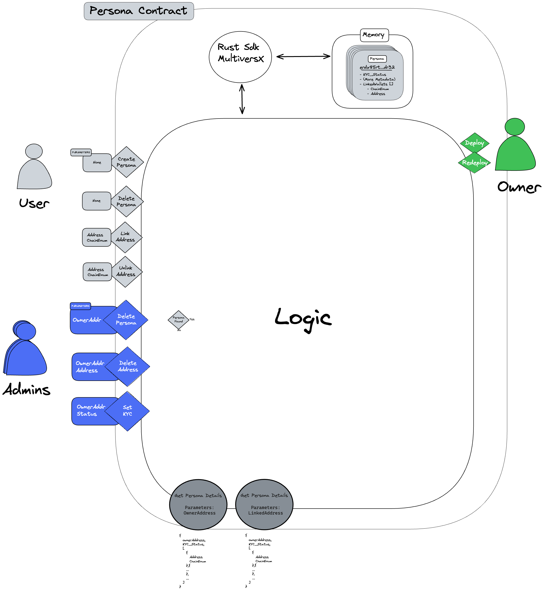

# Smart Contracts

## Overview

This project focuses on the implementation of smart contracts to manage user data in a multichain environment. Each user will have a set of data referred to as a "Persona." Given that the application is multichain, the smart contract needs to be deployed across various blockchains supported by the Persona solution.

To streamline development, maintenance, and future growth, a single codebase is used for deployment on different blockchains.

## Persona Structure

A Persona consists of the following elements:

```plaintext
PERSONA:
- KYC STATUS
- ADDITIONAL METADATA...
- LinkedWallets[]
    - Address
    - Chain
```

### Key Features

#### Readable Endpoints

1. **Get Persona by Owner Address**  
   Retrieve all information related to a Persona using the owner's address.  
   - **Parameters**: `OwnerAddress`
   - **Returns**: The entire Persona associated with the provided address.

2. **Get Owner by Linked Address**  
   Retrieve the Persona associated with a specific address and chain.  
   - **Parameters**: `Address`, `Chain`
   - **Returns**: The owner of the specified address.

#### User Functions

1. **Create Persona**  
   Create a new Persona for the sender of the transaction.  
   - **Parameters**: None
   - **Returns**: The entire Persona associated with the sender.

2. **Delete Persona**  
   Delete the Persona associated with the sender of the transaction.  
   - **Parameters**: None
   - **Returns**: None

3. **Link Address to Persona**  
   Add an address to the Persona associated with the sender of the transaction.  
   - **Parameters**: `Address`, `Chain`
   - **Returns**: The entire Persona associated with the sender.

4. **Unlink Address from Persona**  
   Remove an address from the Persona associated with the sender of the transaction.  
   - **Parameters**: `Address`, `Chain`
   - **Returns**: The entire Persona associated with the sender.

#### Admin Functions

1. **Delete Persona**  
   Delete the Persona linked to the provided address.  
   - **Parameters**: `Address`
   - **Returns**: None

2. **Delete Address from Persona**  
   Remove an address from the Persona linked to the provided address.  
   - **Parameters**: `Address`, `Chain`
   - **Returns**: None

## Architecture

The architecture diagram below illustrates the design and structure of the smart contract.


